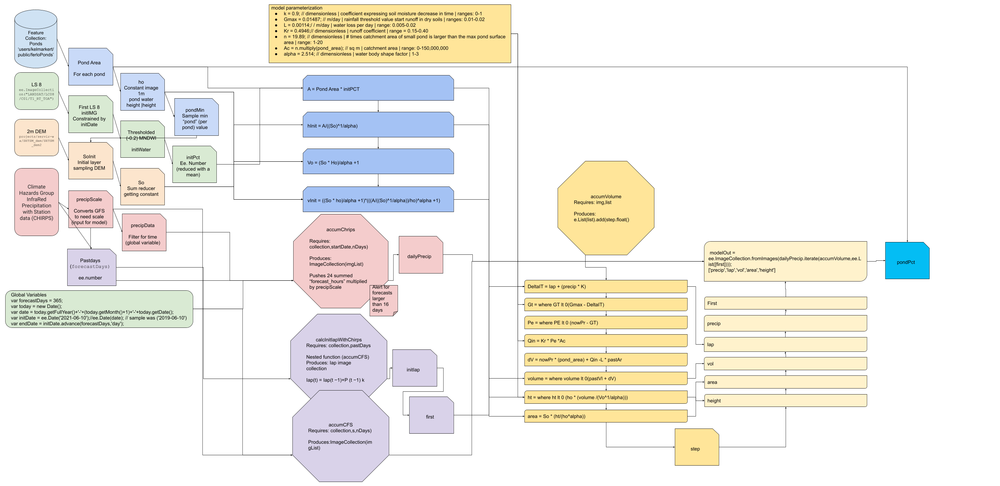

# WENDOU

[MONITORING EPHEMERAL WATER BODIES (WENDOU)](https://servir.icrisat.org/monitoring-ephemeral-water-bodies-wendou/)

West Africa faces challenges related to high population growth, poverty, unsustainable land use practices, and ecosystem degradation, the need for improved governance, and climate variability and change. Beyond being a direct threat, climate change will exacerbate existing tensions in West Africa by impacting water availability, food security, disease prevalence, coastlines, and population distribution in the region. Without adaptive measures that increase local resiliency; physical, human, and financial losses are expected to be significant. Many of these challenges to West Africa can be addressed in part with geospatial information. Timely geospatial data can provide new insights to facilitate solutions to the greatest development challenges. The pond monitoring service became operational through the “WENDOU” platform available here, from which the NGO AVSF (Agronomes et Vétérinaires Sans Frontières) is disseminating information. The process relies on a set of community radios, relay antennas throughout the Ferlo region, but also on the dissemination of messages to a phone database of users (text and audio in several languages) by a start-up company called Jokalante. The URAC network has to be helped for increasing the number of community radios.

<<<<<<< HEAD
https://servirglobal.net/services/monitoring-ephemeral-water-bodies-ferlo-senegal

https://waterwatch.servirglobal.net/

https://youtu.be/OQgirB0fnmU?si=L5FT81yM5gaCA1gr

<<<<<<< HEAD
<!-- #.png.png) -->
=======
<!-- # -->
>>>>>>> 987470ef311f91ae0a37950b78d95690e42bd42f
=======

>>>>>>> 1bfd6672baf8bf7727e687c825ef593bbe702662

